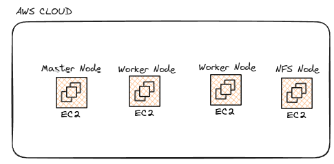

# Proyecto 2

## Luis Felipe Arredondo Giraldo

## 1. Descripción

En este proyecto, se implementa un sistema de gestión de contenido (CMS) utilizando la tecnología de Kubernetes, configurando un clúster con un mínimo de 3 máquinas virtuales (una master y dos workers) mediante MicroK8s. Desplegamos una aplicación de WordPress con MicroK8s en AWS, donde se crearon las instancias master y workers. Además, se configuró un servidor NFS para asegurar la persistencia de los datos de WordPress y la base de datos, incluso si alguno de los pods falla. El proyecto también incluye un dominio propio y un certificado SSL.

### 1.1. Requisitos

- Creación de un clúster de Kubernetes con MicroK8s, incluyendo una instancia master y dos instancias worker.
- Registro de dominio propio (proyecto2.moto-hub.tech).
- Implementación de un certificado SSL.
- Configuración de una capa de acceso mediante MicroK8s Ingress.
- Despliegue de WordPress con sus respectivos deployment, service, pv y pvc.
- Despliegue de una base de datos MySQL con deployment, service, pv y pvc.
- Configuración de un servidor NFS externo al clúster para almacenamiento.

## 2. Arquitectura del sistema

Diagrama de recursos cloud utilizados



Distribucion k8s implementada en cada una de las instancias


Arquitectura del resultado de la aplicacion final


## 3. Descripción del Ambiente de Desarrollo y Técnico

Se utilizó MicroK8s para configurar el clúster. Las máquinas virtuales se crearon en AWS. Las versiones de las imágenes de Docker utilizadas fueron:

- [docker.io/bitnami/mysql:8.0](http://docker.io/bitnami/mysql:8.0)
- wordpress

Para el NFS se utilizó la versión 4.1. En total, se crearon 4 instancias en AWS: una para el master, dos para los workers y una para el servidor NFS. Todas las instancias usan Ubuntu 24.04 LTS. A continuación, se detallan los pasos:

### 3.1. Creación de la VPC

Se configuró una VPC con 2 subnets públicas.

### 3.2. Creación del Grupo de Seguridad


### 3.3. Creación de Instancias

Se utilizaron configuraciones uniformes para todas las instancias:


Cada instancia se configuró con 2 CPUs, 8 GB de RAM y 25 GB de almacenamiento. Las instancias fueron:

Se configuro la instancia master como una t2.large, los dos worker como t2.medium y el nfs como t2.medium con 25gb de almacenamiento.


Una IP elástica se asignó a la instancia master para mantener una dirección IP fija.

### 3.4. Configuración de las Instancias

Se ejecutaron los siguientes comandos en todas las instancias:

```
sudo apt update
sudo apt upgrade -y
sudo snap install microk8s --classic --channel=1.30/stable
sudo usermod -aG microk8s $USER
mkdir -p ~/.kube
sudo chown -f -R $USER ~/.kube
(reiniciar terminal)
microk8s status --wait-ready
microk8s enable dashboard dns registry istio ingress
sudo apt install nfs-common

```

[Instrucciones de MicroK8s](https://microk8s.io/docs/)

### 3.5. Conectar los workers al master

En la instancia master:

```
microk8s add-node

```

Ejecutar el comando resultante en cada worker para unirlo al clúster.

### 3.6. Configuración del NFS

Siga [este tutorial](https://microk8s.io/docs/how-to-nfs) para configurar NFS en una instancia dedicada en AWS.

### 3.7. Agregar CSI en el Nodo Master para el NFS

Seguir la documentación de [instalación del driver CSI para NFS](https://microk8s.io/docs/how-to-nfs).

### 3.8. Crear Manifiestos Necesarios en el Master para el NFS

**Crear StorageClass para NFS:**

```yaml
apiVersion: storage.k8s.io/v1
kind: StorageClass
metadata:
  name: nfs-csi
provisioner: nfs.csi.k8s.io
parameters:
  server: 10.0.0.6
  share: /srv/nfs
reclaimPolicy: Delete
volumeBindingMode: Immediate
mountOptions:
  - hard
  - nfsvers=4.1

```

```
microk8s kubectl apply -f sc-nfs.yaml
microk8s kubectl get storageclass

```

**Crear PersistentVolumeClaim usando el StorageClass nfs-csi:**

```yaml
apiVersion: v1
kind: PersistentVolumeClaim
metadata:
  name: my-pvc
spec:
  storageClassName: nfs-csi
  accessModes: [ReadWriteOnce]
  resources:
    requests:
      storage: 7Gi

```

```
microk8s kubectl apply -f pvc-nfs.yaml
microk8s kubectl get persistentvolumeclaim

```

### 3.9. Configurar Manifiestos de MySQL

```yaml
apiVersion: apps/v1
kind: Deployment
metadata:
  name: wordpress-mysql
  labels:
    app: wordpress
spec:
  selector:
    matchLabels:
      app: wordpress
      tier: mysql
  strategy:
    type: Recreate
  template:
    metadata:
      labels:
        app: wordpress
        tier: mysql
    spec:
      containers:
      - name: mysql
        image: docker.io/bitnami/mysql:8.0
        env:
        - name: MYSQL_ROOT_PASSWORD
          value: root
        - name: MYSQL_DATABASE
          value: wordpressdb
        - name: MYSQL_USER
          value: admin
        - name: MYSQL_PASSWORD
          value: root
        ports:
        - containerPort: 3306
          name: mysql
        volumeMounts:
        - name: mysql-persistent-storage
          mountPath: /var/lib/mysql
      volumes:
      - name: mysql-persistent-storage
        persistentVolumeClaim:
          claimName: mysql-pvc

```

```yaml
apiVersion: v1
kind: PersistentVolume
metadata:
  name: mysql-pv
spec:
  capacity:
    storage: 7Gi
  volumeMode: Filesystem
  accessModes:
    - ReadWriteMany
  persistentVolumeReclaimPolicy: Retain
  storageClassName: nfs-csi
  nfs:
    server: 10.0.0.6
    path: /srv/nfs

```

```yaml
apiVersion: v1
kind: PersistentVolumeClaim
metadata:
  name: mysql-pvc
  labels:
    app: mysql
spec:
  accessModes:
    - ReadWriteMany
  storageClassName: nfs-csi
  resources:
    requests:
      storage: 7Gi

```

```yaml
apiVersion: v1
kind: Service
metadata:
  name: mysql
  labels:
    app: wordpress
spec:
  ports:
    - port: 3306
  selector:
    app: wordpress
    tier: mysql
  clusterIP: None

```

```
microk8s kubectl apply -f .
microk8s kubectl get pods

```

### **3.10. Configurar manifiestos de wordpress**

- Se debe correr el siguiente comando en el master para tener los manifiestos organizados `mkdir wordpress-manifests`
- Luego, `cd wordpress-manifests`
- Se deben crear los siguiente manifiestos

```yaml
---
apiVersion: apps/v1
kind: Deployment
metadata:
  name: wordpress
  labels:
    app: wordpress
spec:
  replicas: 2
  selector:
    matchLabels:
      app: wordpress
      tier: frontend
  strategy:
    type: Recreate
  template:
    metadata:
      labels:
        app: wordpress
        tier: frontend
    spec:
      containers:
      - image: wordpress
        name: wordpress
        env:
        - name: WORDPRESS_DB_HOST
          value: mysql
        - name: WORDPRESS_DB_PASSWORD
          value: root
        - name: WORDPRESS_DB_USER
          value: root
        - name: WORDPRESS_DB_NAME
          value: wordpressdb
        - name: WORDPRESS_DEBUG
          value: "1"ports:
        - containerPort: 80
          name: wordpress
        volumeMounts:
        - name: wordpress-persistent-storage
          mountPath: /var/www/html
      volumes:
      - name: wordpress-persistent-storage
        persistentVolumeClaim:
          claimName: wordpress-pvc
```

```yaml
---
apiVersion: v1
kind: PersistentVolume
metadata:
  name:  wordpress-pv
spec:
  capacity:
    storage: 7Gi
  volumeMode: Filesystem
  accessModes:
    - ReadWriteMany
  persistentVolumeReclaimPolicy: Retain
  storageClassName: nfs-csi
  nfs:
    server: 10.0.0.6
    path: /srv/nfs
```

```yaml
---
apiVersion: v1
kind: PersistentVolumeClaim
metadata:
  name: wordpress-pvc
  labels:
    app: wordpress
spec:
  accessModes:
    - ReadWriteMany
  storageClassName: nfs-csi
  resources:
    requests:
      storage: 7Gi
```

```yaml
---

apiVersion: v1
kind: Service
metadata:
  name: wordpress
  labels:
    app: wordpress
spec:
	type: Load Balancer
  ports:
  - port: 80
  selector:
    app: wordpress
    tier: frontend

```

- Luego se debe correr el siguiente comando para aplicar todos los manifiestos, debemos esperar un momento a que se ejecute todo. `microk8s kubectl apply -f .`
- Validamos el estado de ejecuccion con `microk8s kubectl get pods`

**3.11. Configurar Ingress**

- Se debe correr el siguiente comando en el master para tener los manifiestos organizados `mkdir ingress`
- Luego, `cd ingress`
- Se deben crear los siguiente manifiestos

```yaml
---
apiVersion: networking.k8s.io/v1
kind: Ingress
metadata:
  name: http-ingress
  labels:
    app: wordpress
spec:
  rules:
  - http:
      paths:
      - pathType: Prefix
        path: "/"backend:
          service:
            name: wordpress
            port:
              number: 80
```

- Luego se debe correr el siguiente comando para aplicar todos los manifiestos, debemos esperar un momento a que se ejecute todo. `microk8s kubectl apply -f .`
- Validamos el estado de ejecuccion con `microk8s kubectl get pods`

Con todo lo anterior podemos acceder a la IP Publica de nuestro master y ya deberiamos poder ver el instalador de wordpress funcionando.

**3.12. Configurar dominio y certificado SSL**

- Agregar el registro de la IP pública de la máquina MASTER en nuestro servidor DNS, con el fin de que pueda resolver el dominio y mappearlo al MASTER de manera correcta.
- Ejecutar los siguiente comandos
    - `microk8s kubectl apply -f https://github.com/cert-manager/cert-manager/releases/download/v1.8.0/cert-manager.crds.yaml`
    - `microk8s kubectl create namespace cert-manager`
    - `microk8s kubectl apply -f https://github.com/cert-manager/cert-manager/releases/download/v1.8.0/cert-manager.yaml`
    - Validamos la creación exitosa de 3 pods con `microk8s kubectl get pods -n=cert-manager`
    - Validamos los logs `microk8s kubectl logs -n cert-manager -l app=cert-manager`
    - Ahora `mkdir ssl`
    - `cd ssl`
    - Creamos 2 claves para los archivos `cluster-issuer-staging.yaml` y `cluster-issuer.yaml` con:
        - `openssl genrsa -out letsencrypt-staging.pem 2048`
        - `openssl genrsa -out letsencrypt-private-key.pem 2048`
    - Creamos los secretos:
        - `sudo microk8s kubectl create secret generic letsencrypt-staging --from-file=letsencrypt-staging.pem`
        - `microk8s kubectl create secret generic letsencrypt-private-key --from-file=letsencrypt-private-key.pem`
- Ahora debemos crear los manifiestos para el certificado SSL

```yaml
---
apiVersion: cert-manager.io/v1
kind: ClusterIssuer
metadata:
  name: letsencrypt-prod
spec:
  acme:
    # The ACME server URL
    server: https://acme-v02.api.letsencrypt.org/directory
    # Email address used for ACME registration
    email: pipechiqui77@gmail.com
    # Name of a secret used to store the ACME account private key
    privateKeySecretRef:
      name: letsencrypt-private-key
    # Enable the HTTP-01 challenge provider
    solvers:
      - http01:
          ingress:
            class: public
```

```yaml
---
apiVersion: cert-manager.io/v1
kind: ClusterIssuer
metadata:
  name: letsencrypt-staging
spec:
  acme:
    email: pipechiqui77@gmail.com
    server: https://acme-staging-v02.api.letsencrypt.org/directory
    privateKeySecretRef:
      name: letsencrypt-staging
    solvers:
    - http01:
        ingress:
          class: public
```

- Ahora ejecutamos los siguientes comandos:
    - `microk8s kubectl apply -f cluster-issuer-staging.yaml`
    - `microk8s kubectl apply -f cluster-issuer.yaml`
    - Validamos el estado con `microk8s kubectl get clusterissuer`
- Ahora creamos el siguiente manifiesto:

```yaml
---
apiVersion: networking.k8s.io/v1
kind: Ingress
metadata:
  name: ingress-routes
  annotations:
    # Change this when staging already works for "letsencrypt-prod"
    cert-manager.io/cluster-issuer: "letsencrypt-staging"spec:
  tls:
  - hosts:
#change to your domain
    - proyecto2.moto-hub.tech
    secretName: tls-secret
  rules:
#change to your domain
  - host: proyecto2.moto-hub.tech
    http:
      paths:
      - path: /
        pathType: Prefix
        backend:
          service:
            name: wordpress
            port:
              number: 80

```

- Aplicamos el manifiesto. `microk8s kubectl apply -f ingress-routes.yaml`
- Validamos la creación del certificado. Para hacer esto debemos esperar un momento que pase de false a true `microk8s kubectl get certificate`
- Cuando pase a true ya podremos cambiar el `staging` del ingress-routes.yaml por `prod` y aplicar nuevamente el manifiesto.